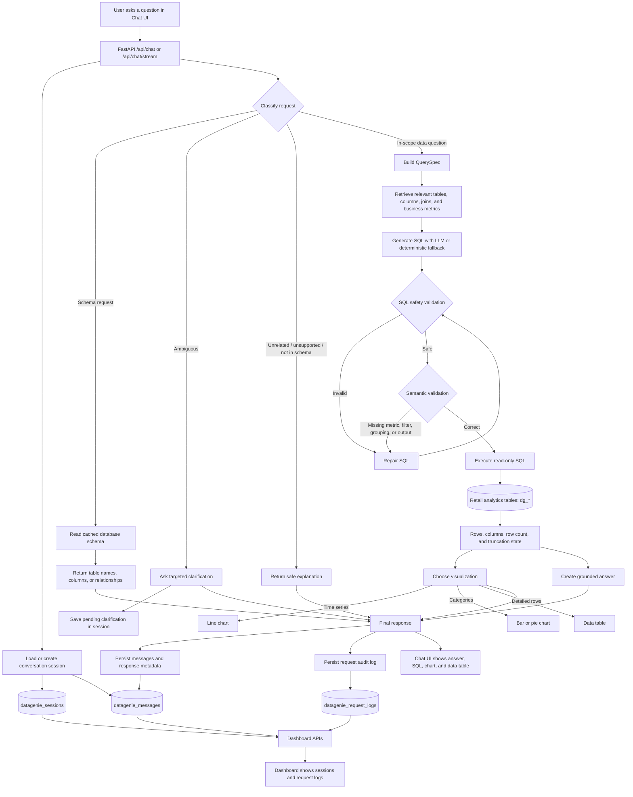

# Data Genie Query Workflow

This document describes how a user request travels through Data Genie—from the
chat interface to a grounded answer, visualization, persistent conversation
memory, and dashboard audit log.

## Request paths

| Request type | Handling | SQL executed? |
| --- | --- | --- |
| Schema metadata | Returns table names, columns, or foreign-key relationships from the cached schema | No |
| Ambiguous data question | Requests missing details and stores the clarification state | No |
| Unsupported or unrelated request | Gives a safe, explanatory response | No |
| Valid analytics question | Plans, generates, validates, executes, summarizes, and visualizes SQL results | Yes |

## Persistence

- `datagenie_sessions`: conversation ID, timestamps, and pending clarification state.
- `datagenie_messages`: user/assistant messages and assistant response metadata needed to restore SQL, results, and charts after a refresh.
- `datagenie_request_logs`: request text, classification, latency, row count, status, and errors shown in the Dashboard.

The operational tables use the `datagenie_` prefix instead of `dg_`, so the
Text-to-SQL workflow does not include internal memory or log records in user
analytics queries.
