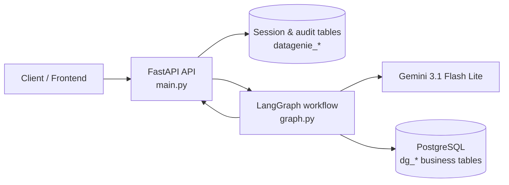
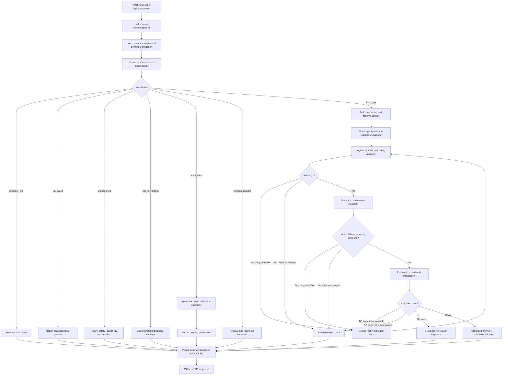
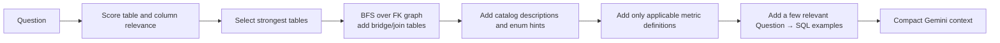
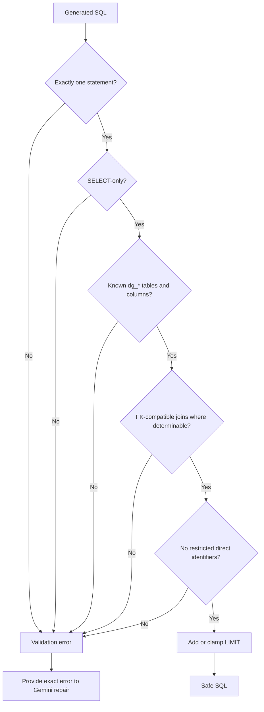
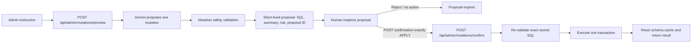

# Data Genie — Backend Text-to-SQL Workflow

This is the complete backend flow. The system is designed to answer general questions about the connected `dg_*` PostgreSQL schema, not a fixed list of pre-written questions.

## System boundary



`datagenie_*` tables store conversations and audit records. They are never exposed to Text-to-SQL. Only `dg_*` tables are available for analytics.

## End-to-end request lifecycle



## 1. Session and follow-up handling

Files: `main.py`, `conversation_store.py`

1. The API receives a message and optional `conversation_id`.
2. It creates the session if needed and loads recent history from `datagenie_messages`.
3. If a prior question required clarification, the new answer is combined with the original request and pending questions.
4. History is included in intent classification and SQL generation so Gemini can resolve follow-ups such as “only Germany,” “compare it with last year,” or “show their columns.”
5. The final response plus its SQL, result metadata, and latency are persisted for the session/dashboard.

## 2. Intent decision

Files: `classifier.py`, `llm.py`

Gemini receives the user request, recent messages, and the allowed table names. It returns structured JSON:

```json
{
  "label": "in_scope",
  "reason": "The request can be answered from orders and payments.",
  "missing": [],
  "questions": []
}
```

| Label | Meaning | Database query? |
| --- | --- | --- |
| `in_scope` | Clear analytical question supported by the data | Yes, after validation |
| `schema_request` | Asking about tables, columns, or relationships | No; read cached metadata |
| `ambiguous` | Required metric, entity, date, grouping, or ranking is unclear | No; ask a follow-up |
| `unsupported` | Write/destructive action, direct sensitive identifier request, or unsupported operation | No |
| `not_in_schema` | Required business data does not exist | No |
| `unrelated` | Not a data/schema question | No |
| `assistant_info` | Asking how Data Genie works | No |

No SQL is generated until the intent is `in_scope`.

## 3. Live schema and context retrieval

Files: `schema_introspection.py`, `schema_catalog.py`, `schema_retrieval.py`, `metrics.py`, `example_bank.py`

### Cached live schema

SQLAlchemy reflects the database and caches:

- allowed table names (`dg_*` only);
- every column, type, nullability, primary key, and foreign key;
- foreign-key join graph;
- bounded row counts and samples.

The cache avoids repeatedly introspecting PostgreSQL. It is reset after a seed or schema migration.

### Compact context selection

For each question, the retrieval layer selects only the useful parts of the schema:



The context includes explicit join paths. Example:

```text
dg_inventory.warehouse_id = dg_warehouses.warehouse_id
dg_warehouses.region_id = dg_regions.region_id
dg_inventory.product_id = dg_products.product_id
```

The full 23-table schema is not put in every prompt.

## 4. Query planning and SQL generation

Files: `query_spec.py`, `llm.py`

`QuerySpec` records what the user explicitly requested:

- metric: revenue, inventory value, active customers, etc.;
- dimensions/grouping: month, category, country, warehouse;
- filters: dates, status, country, product;
- output: ranking, Top-N, comparison, trend, detailed rows.

Gemini receives the compact retrieved context, permitted joins, business definitions, examples, recent conversation, and the question. It must return exactly one PostgreSQL `SELECT` statement with no explanation.

Generic SQL generation requires configuration in the root `.env`:

```env
GOOGLE_API_KEY=your_key
GEMINI_MODEL=gemini-3.1-flash-lite
```

If Gemini is unavailable, the backend does not guess or substitute unrelated template SQL.

## 5. SQL safety validation

File: `sql_validation.py`

Every generated statement is parsed with SQLGlot before database execution.



The validator rejects `INSERT`, `UPDATE`, `DELETE`, `DROP`, `ALTER`, `TRUNCATE`, `CREATE`, grants, revokes, multiple statements, unknown objects, unsafe functions, and direct restricted personal/payment fields. It also enforces a maximum row limit.

`semantic_validation.py` then checks that generated SQL fulfills required metrics, filters, grouping, ranking, and output details from `QuerySpec`.

## 6. Repair loop

Files: `graph.py`, `llm.py`

If parsing, validation, semantic checks, or execution fails, Gemini receives:

- the original question;
- the failed SQL;
- the exact failure message;
- the same compact schema context.

It can generate a corrected query. The loop is capped by `MAX_REPAIR_RETRIES` (default 2):

```text
generate → validate → repair → validate → repair → validate → succeed or safe failure
```

The agent never retries indefinitely.

## 7. Safe database execution

File: `db.py`

Validated queries run under a read-only transaction:

```sql
SET TRANSACTION READ ONLY;
SET LOCAL statement_timeout = <configured milliseconds>;
SET LOCAL lock_timeout = <configured milliseconds>;
```

Execution returns:

- column names;
- up to `MAX_ROWS` JSON-safe records;
- row count;
- a `truncated` flag if more records existed.

An optional PostgreSQL plan-cost limit can reject expensive queries before execution.

## 8. Answer and visualization

Files: `answer.py`, `visualization.py`

The answer layer sees returned rows and columns only. It cannot invent figures absent from the result.

| Result shape | Output |
| --- | --- |
| Empty result | Honest no-matching-data answer |
| Time series | Line chart specification |
| Small part-to-whole categories | Pie/donut chart specification |
| Category comparison | Bar chart specification |
| Detailed/multi-column rows | Table specification |

The API response includes the answer, generated SQL, selected tables, columns/rows, row count, chart specification, clarification questions when applicable, and validation error when applicable.

## 9. Admin mutation workflow — human in the loop

Files: `mutations.py`, `main.py`, `sql_validation.py`

The ordinary chat graph remains read-only. Writes use separate admin endpoints and can never execute from a chat response automatically.



This flow requires all of the following:

- `ENABLE_MUTATIONS=true`;
- `AUTH_ENABLED=true`;
- a valid `admin` API key in `X-API-Key`;
- a valid, non-expired proposal ID;
- `confirmation` exactly equal to `APPLY`.

Allowed mutations are one `INSERT`, `UPDATE`, `DELETE`, `CREATE TABLE`, `ALTER TABLE`, or `DROP TABLE` targeting `dg_*` business tables. `UPDATE` and `DELETE` must include a `WHERE` clause. Operational `datagenie_*` tables, multi-statement SQL, grants, revokes, and administrative/database escape-hatch commands are blocked.

## Backend file responsibilities

| File | Responsibility |
| --- | --- |
| `main.py` | FastAPI endpoints, SSE, session/audit orchestration |
| `graph.py` | LangGraph nodes, routing, retries, terminal outcomes |
| `classifier.py` | Gemini structured intent classification |
| `llm.py` | Gemini SQL generation, repair, optional summary |
| `schema_introspection.py` | SQLAlchemy reflection, schema cache, FK join graph |
| `schema_catalog.py` | Table/column business metadata and enum hints |
| `schema_retrieval.py` | Context selection and join-path retrieval |
| `metrics.py` | Configurable business definitions |
| `example_bank.py` | Relevant Question→SQL examples |
| `query_spec.py` | Explicit requirement plan for semantic validation |
| `sql_validation.py` | SQLGlot safety, schema, join, and limit checks |
| `semantic_validation.py` | Metric/filter/grouping/output completeness checks |
| `db.py` | Read-only transactions, timeouts, result capping |
| `answer.py` | Grounded natural-language response |
| `visualization.py` | Deterministic chart/table selection |
| `conversation_store.py` | Conversation/pending-clarification/audit persistence |
